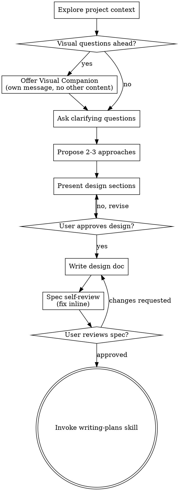

---

name: superpowers-brainstorming
description: "You MUST use this before any creative work - creating features, building components, adding functionality, or modifying behavior. Explores user intent, requirements and design before implementation."
version: "5.1.0"
author: "Jesse Vincent (obra)"
license: MIT
platforms: [linux, macos]
namespace: superpowers
source: "https://github.com/obra/superpowers"
metadata:
  hermes:
    tags: [superpowers, methodology, workflow]
    homepage: "https://github.com/obra/superpowers"
---

## ⚡ HERMES ENFORCEMENT (additive to upstream)

**This is a HARD GATE. It applies to every creative request in this workspace, no exceptions.**

**Mandatory trigger:** When the user message contains ANY of:
- "crea", "crear", "diseña", "diseñar", "construye", "construir", "build", "create", "design"
- "implementa", "implementar", "implement", "add a feature", "añade", "agrega"
- "hazme una app", "quiero una app", "let's make", "I want to build", "I want to make"
- "nueva feature", "nueva funcionalidad", "new feature", "new functionality"
- "modify behavior", "modify the", "cambiar el comportamiento"
- ANY description of what to build / how something should work

Then:

1. **STOP.** Do not write code, scaffold, install, or call any implementation tool.
2. **Invoke this skill via skill_view first** if you haven't already this turn.
3. **Respond with a single message that says**: "Using superpowers-brainstorming to explore what we're building. I won't write any code until we've agreed on a design."
4. **Ask one question at a time**, in order: context → purpose → constraints → success criteria → approaches.
5. **Present 2-3 approaches with trade-offs and a recommendation.**
6. **Present the design in sections, scaled to complexity. Get approval after each section.**
7. **Write the spec to `docs/superpowers/specs/YYYY-MM-DD-<topic>-design.md`** (or user-specified path). Commit it.
8. **Self-review** the spec for placeholders, contradictions, ambiguity, scope.
9. **Wait for explicit user approval** of the written spec.
10. **ONLY THEN** invoke `superpowers-writing-plans` and proceed.

**Anti-rationalization table — DO NOT argue with these:**

| Excuse | Reality |
|---|---|
| "User said it's simple" | "Simple" projects are where unexamined assumptions cause the most wasted work. Brainstorming is faster than rewriting. |
| "User already described it" | Description ≠ aligned understanding. The user thinks they explained it; they didn't. Ask. |
| "I'll just do it then ask" | Once code exists, sunk-cost bias makes the user accept it. The design gate exists BECAUSE rewriting is expensive. |
| "It's just a config change" | Config changes break systems. They need a spec. (Exception: trivial 1-line tweaks, see below.) |
| "User said go fast" | Brainstorming a 1-page design is 5 minutes. Re-coding for 2 days is not fast. |
| "I'll skip the doc, just chat" | The chat loses context. The doc is the artifact that survives. |
| "User said 'apply your recommendations in everything'" | That IS batch approval for the recommended path. Proceed: write the spec, the plan, and execute. Stop re-asking for the same decisions. Reserve clarification only for genuinely new questions the user did not pre-approve. |

**The TWO allowed exceptions:**
1. A user says "just do X, no need to ask" AND X is a single, well-defined, reversible, low-risk action (typo fix, linter cleanup, dependency bump). Otherwise, brainstorm.
2. A user says "apply your recommendations in everything" / "you decide" / "go with your best judgment" / "dame tu recomendación" AFTER the design options have been presented. This is **batch approval** for the recommended path: write the spec, write the plan, execute. Do not re-ask for the same decisions the user already delegated. Ask only for genuinely new questions.

**Failure mode this prevents:** Building the wrong thing and finding out at demo time. The brainstorming gate costs minutes; misalignment costs days.
> **Port of `brainstorming` from [obra/superpowers](https://github.com/obra/superpowers) v5.1.0.** Original by Jesse Vincent. Adapted to Hermes skill format.

# Brainstorming Ideas Into Designs

Help turn ideas into fully formed designs and specs through natural collaborative dialogue.

Start by understanding the current project context, then ask questions one at a time to refine the idea. Once you understand what you're building, present the design and get user approval.

<HARD-GATE>
Do NOT invoke any implementation skill, write any code, scaffold any project, or take any implementation action until you have presented a design and the user has approved it. This applies to EVERY project regardless of perceived simplicity.
</HARD-GATE>

## Anti-Pattern: "This Is Too Simple To Need A Design"

Every project goes through this process. A todo list, a single-function utility, a config change — all of them. "Simple" projects are where unexamined assumptions cause the most wasted work. The design can be short (a few sentences for truly simple projects), but you MUST present it and get approval.

## Checklist

You MUST create a task for each of these items and complete them in order:

1. **Explore project context** — check files, docs, recent commits
2. **Offer visual companion** (if topic will involve visual questions) — this is its own message, not combined with a clarifying question. See the Visual Companion section below.
3. **Ask clarifying questions** — one at a time, understand purpose/constraints/success criteria
4. **Propose 2-3 approaches** — with trade-offs and your recommendation
5. **Present design** — in sections scaled to their complexity, get user approval after each section
6. **Write design doc** — save to `docs/superpowers/specs/YYYY-MM-DD-<topic>-design.md` and commit
7. **Spec self-review** — quick inline check for placeholders, contradictions, ambiguity, scope (see below)
8. **User reviews written spec** — ask user to review the spec file before proceeding
9. **Transition to implementation** — invoke writing-plans skill to create implementation plan

## Process Flow

**The terminal state is invoking writing-plans.** Do NOT invoke frontend-design, mcp-builder, or any other implementation skill. The ONLY skill you invoke after brainstorming is writing-plans.

## The Process

**Understanding the idea:**

- Check out the current project state first (files, docs, recent commits)
- Before asking detailed questions, assess scope: if the request describes multiple independent subsystems (e.g., "build a platform with chat, file storage, billing, and analytics"), flag this immediately. Don't spend questions refining details of a project that needs to be decomposed first.
- If the project is too large for a single spec, help the user decompose into sub-projects: what are the independent pieces, how do they relate, what order should they be built? Then brainstorm the first sub-project through the normal design flow. Each sub-project gets its own spec → plan → implementation cycle.
- For appropriately-scoped projects, ask questions one at a time to refine the idea
- Prefer multiple choice questions when possible, but open-ended is fine too
- Only one question per message - if a topic needs more exploration, break it into multiple questions
- Focus on understanding: purpose, constraints, success criteria

**Exploring approaches:**

- Propose 2-3 different approaches with trade-offs
- Present options conversationally with your recommendation and reasoning
- Lead with your recommended option and explain why

**Presenting the design:**

- Once you believe you understand what you're building, present the design
- Scale each section to its complexity: a few sentences if straightforward, up to 200-300 words if nuanced
- Ask after each section whether it looks right so far
- Cover: architecture, components, data flow, error handling, testing
- Be ready to go back and clarify if something doesn't make sense

**Design for isolation and clarity:**

- Break the system into smaller units that each have one clear purpose, communicate through well-defined interfaces, and can be understood and tested independently
- For each unit, you should be able to answer: what does it do, how do you use it, and what does it depend on?
- Can someone understand what a unit does without reading its internals? Can you change the internals without breaking consumers? If not, the boundaries need work.
- Smaller, well-bounded units are also easier for you to work with - you reason better about code you can hold in context at once, and your edits are more reliable when files are focused. When a file grows large, that's often a signal that it's doing too much.

**Working in existing codebases:**

- Explore the current structure before proposing changes. Follow existing patterns.
- Where existing code has problems that affect the work (e.g., a file that's grown too large, unclear boundaries, tangled responsibilities), include targeted improvements as part of the design - the way a good developer improves code they're working in.
- Don't propose unrelated refactoring. Stay focused on what serves the current goal.

## After the Design

**Documentation:**

- Write the validated design (spec) to `docs/superpowers/specs/YYYY-MM-DD-<topic>-design.md`
  - (User preferences for spec location override this default)
- Use elements-of-style:writing-clearly-and-concisely skill if available
- Commit the design document to git

**Spec Self-Review:**
After writing the spec document, look at it with fresh eyes:

1. **Placeholder scan:** Any "TBD", "TODO", incomplete sections, or vague requirements? Fix them.
2. **Internal consistency:** Do any sections contradict each other? Does the architecture match the feature descriptions?
3. **Scope check:** Is this focused enough for a single implementation plan, or does it need decomposition?
4. **Ambiguity check:** Could any requirement be interpreted two different ways? If so, pick one and make it explicit.

Fix any issues inline. No need to re-review — just fix and move on.

**User Review Gate:**
After the spec review loop passes, ask the user to review the written spec before proceeding:

> "Spec written and committed to `<path>`. Please review it and let me know if you want to make any changes before we start writing out the implementation plan."

Wait for the user's response. If they request changes, make them and re-run the spec review loop. Only proceed once the user approves.

**Implementation:**

- Invoke the writing-plans skill to create a detailed implementation plan
- Do NOT invoke any other skill. writing-plans is the next step.

**Key Principles**

- **One question at a time** - Don't overwhelm with multiple questions
- **Multiple choice preferred** - Easier to answer than open-ended when possible
- **YAGNI ruthlessly** - Remove unnecessary features from all designs
- **Explore alternatives** - Always propose 2-3 approaches before settling
- **Incremental validation** - Present design, get approval before moving on
- **Be flexible** - Go back and clarify when something doesn't make sense

**Default cadence for this workspace (Hermes enforcement, 2026-06-05):**

- Use **≤5 questions per brainstorm** covering: purpose → users → scope/scope-bounding → key technical choices → approach/architecture. If you need more, you probably need to decompose into sub-projects first.
- **Every question is a multiple-choice menu with 3-4 mutually exclusive options + a recommended one marked clearly.** Open-ended questions only as a last resort. The user has explicitly praised this format ("esto es super bueno") and responds fast to it.
- **Mark which option you recommend in the question text** (e.g., "Recommend: option 3"). This lets the user delegate in one reply: "dale con tu recomendación" / "aplica tus recomendaciones" / "go with your best judgment" is a valid answer that picks all recommended options.
- **Respect cancellation gracefully.** If the user says "para", "no es necesario", "cancel" mid-flow, stop immediately, confirm what (if anything) is left undone, and offer to resume later. Do not push back or restart the flow.

**Anti-pattern this prevents:** Asking 8 open-ended questions that the user has to compose replies to (slow, high drop-off), or jumping to design after 1 question (insufficient alignment). The 5-question / 4-option cadence is a tested balance.

## "Show me what this would look like in practice" requests

Sometimes the user replies with "dame un paso a paso" or "what would
the system look like with this?" before deciding. This is **not** a
request to skip the design — it is a request for **concretization** so
they can spot the right questions to ask.

**Recipe (worked in a 2026-06-05 session, user said "esto es super bueno"):**

1. Pick a concrete user-facing scenario (e.g. "I just opened a terminal,
   I type 'X', here's what happens step by step...").
2. Walk through it numbered: trigger → skill loaded → actions → output.
3. End with a **YAGNI table**: a numbered list of *things that would
   be useful but you do not need*. Format:

   | # | YAGNI item | Why we skip it for now |
   |---|---|---|
   | 1 | Real-time web dashboard | YAGNI until asked |
   | 2 | Anomaly detection | No statistical baseline yet |
   | 3 | Cross-session correlation | Too complex for value |

4. The user picks which YAGNIs (if any) to promote to the design.

**Why this works:** the user can validate the *flow* without committing
to specifics. The YAGNI table surfaces the implicit decisions ("oh, I
actually DO want the dashboard, never mind skipping it") that would
otherwise hide in a 5-question brainstorm.

**Don't combine concretization with the brainstorm menus.** Concretize
in one message (numbered flow + YAGNI table). Then ask the next
brainstorm question. The two modes confuse the user if interleaved.

## Visual Companion

A browser-based companion for showing mockups, diagrams, and visual options during brainstorming. Available as a tool — not a mode. Accepting the companion means it's available for questions that benefit from visual treatment; it does NOT mean every question goes through the browser.

**Offering the companion:** When you anticipate that upcoming questions will involve visual content (mockups, layouts, diagrams), offer it once for consent:
> "Some of what we're working on might be easier to explain if I can show it to you in a web browser. I can put together mockups, diagrams, comparisons, and other visuals as we go. This feature is still new and can be token-intensive. Want to try it? (Requires opening a local URL)"

**This offer MUST be its own message.** Do not combine it with clarifying questions, context summaries, or any other content. The message should contain ONLY the offer above and nothing else. Wait for the user's response before continuing. If they decline, proceed with text-only brainstorming.

**Per-question decision:** Even after the user accepts, decide FOR EACH QUESTION whether to use the browser or the terminal. The test: **would the user understand this better by seeing it than reading it?**

- **Use the browser** for content that IS visual — mockups, wireframes, layout comparisons, architecture diagrams, side-by-side visual designs
- **Use the terminal** for content that is text — requirements questions, conceptual choices, tradeoff lists, A/B/C/D text options, scope decisions

A question about a UI topic is not automatically a visual question. "What does personality mean in this context?" is a conceptual question — use the terminal. "Which wizard layout works better?" is a visual question — use the browser.

If they agree to the companion, read the detailed guide before proceeding:
`skills/brainstorming/visual-companion.md`
